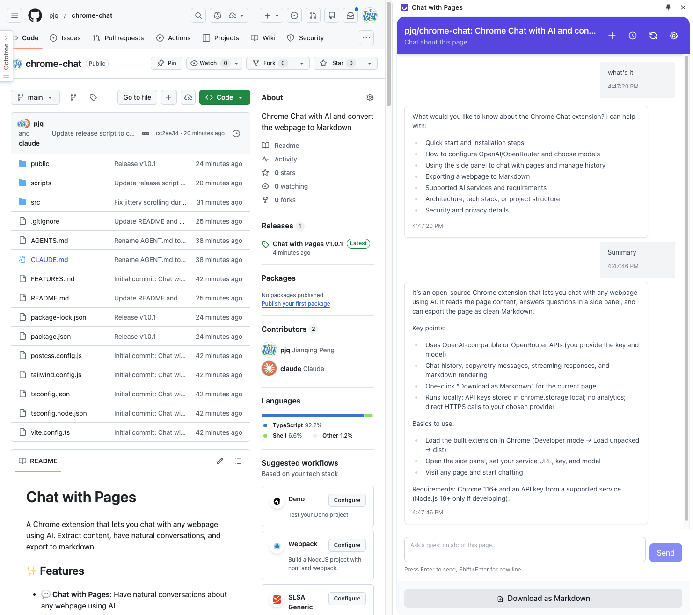

# Chat with Pages

A Chrome extension that lets you chat with any webpage using AI. Extract content, have natural conversations, and export to markdown.

## 📸 Screenshot



## ✨ Features

- **💬 Chat with Pages**: Have natural conversations about any webpage using AI
- **📚 Chat History**: Save and switch between multiple chat sessions
- **🔄 Retry & Copy**: Retry failed responses or copy any message to clipboard
- **🎨 Markdown Rendering**: Beautiful formatting with code syntax highlighting
- **📥 Export to Markdown**: Download pages as clean markdown files
- **🔌 Multiple AI Services**: Support for OpenAI Compatible and OpenRouter APIs
- **⚡ Streaming Responses**: Real-time message streaming for better UX
- **💾 Persistent Storage**: Chat history saved across browser sessions

## 🚀 Quick Start

### Installation

1. **Clone the repository**:
```bash
git clone https://github.com/pjq/chrome-chat.git
cd chrome-chat
```

2. **Install dependencies**:
```bash
npm install
```

3. **Build the extension**:
```bash
npm run build
```

4. **Load in Chrome**:
   - Open Chrome and navigate to `chrome://extensions/`
   - Enable "Developer mode" (toggle in top right)
   - Click "Load unpacked"
   - Select the `dist` folder from this project

### Configuration

1. Click the extension icon in your Chrome toolbar
2. Click the settings icon (⚙️) in the side panel
3. Configure your AI service:
   - Choose your AI service (OpenAI Compatible or OpenRouter)
   - Enter your service URL
   - Add your access key
   - Select an AI model
   - Optionally customize the AI instructions

## 📖 Usage

### Chat with a Page

1. Navigate to any webpage
2. Click the extension icon to open the side panel
3. The page content will be automatically read
4. Start asking questions in the chat input!

### Manage Chat History

- **New Chat**: Click the ➕ icon in the header
- **View History**: Click the 🕐 icon to see all previous chats
- **Switch Chats**: Click any chat in the history to continue it
- **Delete Chat**: Hover over a chat and click the trash icon

### Copy & Retry Messages

- **Copy**: Hover over any message and click "Copy" to copy to clipboard
- **Retry**: Click "Retry" on the last AI message to regenerate the response

### Export to Markdown

Click "Download as Markdown" at the bottom to save the current page as a markdown file.

## ⚙️ Configuration

### Supported AI Services

#### OpenAI Compatible
Any service that implements the OpenAI chat completions API:
- OpenAI (https://api.openai.com/v1/chat/completions)
- Azure OpenAI
- LocalAI
- LM Studio
- Ollama (with OpenAI compatibility)
- And many more...

#### OpenRouter
Access to 100+ AI models from multiple providers:
- Get your key at: https://openrouter.ai/keys
- Endpoint: https://openrouter.ai/api/v1/chat/completions
- Models from OpenAI, Anthropic, Google, Meta, and more

### Settings Explained

- **AI Service**: Choose your API provider
- **Service URL**: The endpoint URL for chat completions
- **Access Key**: Your API authentication key
- **AI Model**: The specific model to use (can auto-load from your service)
- **Instructions for AI**: Custom system prompt to guide the AI's behavior

## 🏗️ Architecture

```
┌─────────────────┐      ┌──────────────────┐      ┌─────────────────┐
│   Side Panel    │◄────►│  Service Worker  │◄────►│ Content Script  │
│   (React UI)    │      │  (Background)    │      │ (Page Content)  │
└─────────────────┘      └──────────────────┘      └─────────────────┘
        │                         │
        │                         │
   Chat UI                   LLM API (Streaming)
   Settings                  Message Routing
   History                   Storage Management
   Markdown Export
```

## 🛠️ Technology Stack

- **Build System**: Vite + @crxjs/vite-plugin
- **Framework**: React 18 + TypeScript
- **Styling**: Tailwind CSS + @tailwindcss/typography
- **State Management**: Zustand with persistence
- **Content Extraction**: @mozilla/readability (Firefox reader mode)
- **Markdown**: react-markdown + remark-gfm + rehype-highlight
- **Chrome API**: Manifest V3 with Side Panel API

## 📁 Project Structure

```
src/
├── background/              # Service worker
│   ├── index.ts            # Message routing, port handling
│   ├── llmService.ts       # Streaming API calls (SSE)
│   └── messageHandler.ts   # Message type handlers
├── content/                # Content scripts
│   ├── index.ts           # Content script entry
│   └── contentExtractor.ts # Readability integration
├── sidepanel/              # React UI
│   ├── App.tsx
│   ├── components/        # UI components
│   ├── hooks/            # React hooks
│   └── store/            # Zustand state management
└── shared/                # Shared code
    ├── types/            # TypeScript interfaces
    ├── utils/            # Utility functions
    └── constants/        # App constants
```

## 🔧 Development

### Commands

```bash
# Development mode with hot reload
npm run dev

# Production build
npm run build

# Preview production build
npm run preview

# Create a new release
./scripts/release.sh [patch|minor|major]
```

### Local Development

1. Run `npm run dev` to start the development server
2. The extension will auto-reload in Chrome on code changes
3. Check the console in the extension's side panel for React dev tools

### Making Changes

- UI components: `src/sidepanel/components/`
- State management: `src/sidepanel/store/`
- API integration: `src/background/llmService.ts`
- Content extraction: `src/content/contentExtractor.ts`

See [AGENTS.md](./AGENTS.md) for detailed development guide.

## 🔒 Security & Privacy

- **Local Storage**: API keys stored in `chrome.storage.local` (device-only, not synced)
- **No Data Collection**: No analytics, tracking, or data sent to third parties
- **Direct API Calls**: All AI requests go directly from your browser to your chosen service
- **Content Sanitization**: Page content cleaned with Readability before processing
- **HTTPS Required**: All API endpoints must use secure HTTPS connections

## 📋 Requirements

- Chrome 116+ (for Side Panel API support)
- Node.js 18+ (for development)
- An API key from OpenAI, OpenRouter, or compatible service

## 🤝 Contributing

Contributions are welcome! Please feel free to submit a Pull Request.

1. Fork the repository
2. Create your feature branch (`git checkout -b feature/amazing-feature`)
3. Commit your changes (`git commit -m 'Add amazing feature'`)
4. Push to the branch (`git push origin feature/amazing-feature`)
5. Open a Pull Request

## 📝 License

MIT License - see [LICENSE](LICENSE) file for details

## 🙏 Acknowledgments

- [Mozilla Readability](https://github.com/mozilla/readability) - Content extraction
- [react-markdown](https://github.com/remarkjs/react-markdown) - Markdown rendering
- [Zustand](https://github.com/pmndrs/zustand) - State management
- Built with ❤️ using [Claude Code](https://claude.com/claude-code)

## 📧 Support

- **Issues**: [GitHub Issues](https://github.com/pjq/chrome-chat/issues)
- **Discussions**: [GitHub Discussions](https://github.com/pjq/chrome-chat/discussions)

---

**Note**: This extension requires an API key from a supported AI service. The extension itself is free and open-source, but AI service usage may incur costs depending on your provider.
